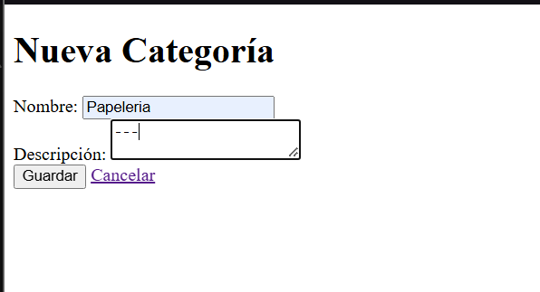
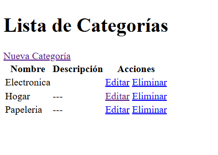
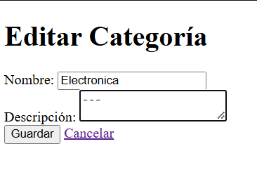
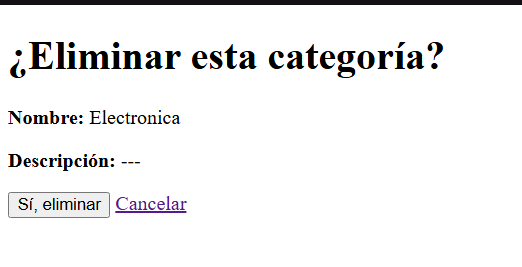
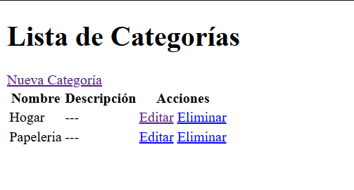
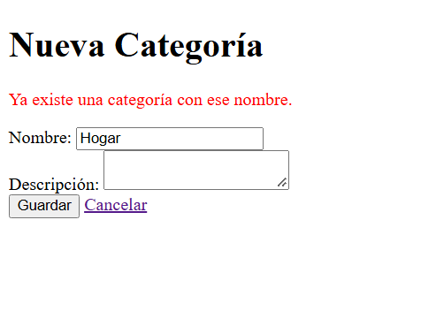
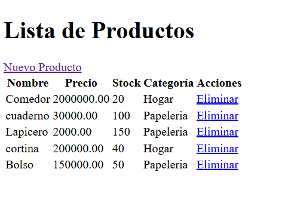
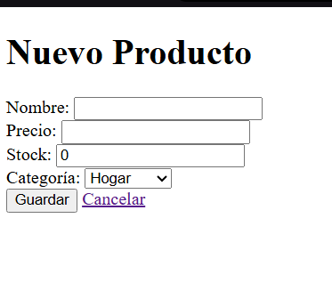
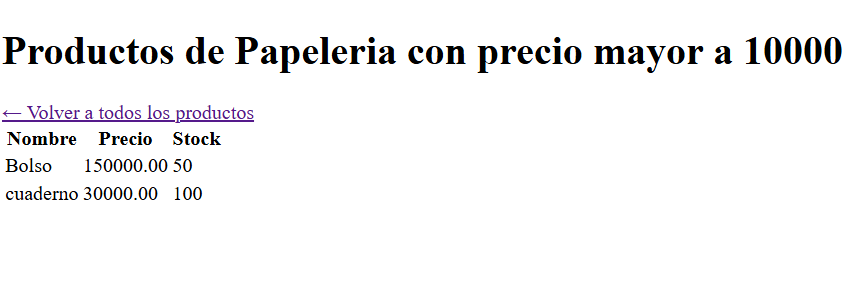
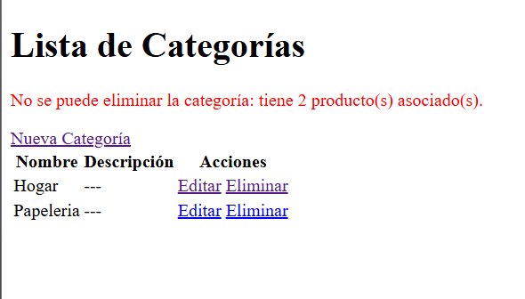

# Post-contenido — Unidad 8: Persistencia con JPA/Hibernate

## Descripción
Repositorio del laboratorio de la Unidad 8 de Programación Web —
Séptimo Semestre. Contiene un único proyecto Maven Spring Boot
(catalogo-jpa/) con un CRUD de categorías usando Spring Data JPA e
Hibernate contra MySQL/MariaDB, y su extensión con la entidad Producto
y una relación @ManyToOne/@OneToMany hacia Categoria.

## Parte 1 — CRUD de Categoría con JPA/Hibernate y MySQL
CategoriaController, CategoriaService y CategoriaRepository
(JpaRepository) gestionan la entidad Categoria, persistida en MySQL
mediante Hibernate. Listado, registro, edición y eliminación con
validación de campos (@NotBlank, nombre único) y plantillas Thymeleaf
(lista.html, formulario.html, confirmar-eliminar.html).

## Parte 2 — Relación @ManyToOne/@OneToMany con Producto
La entidad Producto agrega la relación @ManyToOne hacia Categoria
(columna categoria_id, FetchType.LAZY explícito), con el lado inverso
@OneToMany en Categoria. ProductoRepository expone
buscarPorCategoriaConPrecioMayorA, una consulta JPQL personalizada con
@Query y JOIN FETCH que retorna los productos de una categoría con
precio mayor a un valor dado en una sola sentencia SQL.

## Diagrama de la relación

```
Categoria (1) ──────< (N) Producto
    id                    id
    nombre (unique)       nombre
    descripcion           precio
    productos[]           stock
    (lado inverso,        categoria_id (FK)
     mappedBy="categoria") (lado propietario,
                            @JoinColumn)
```

## Configuración de la base de datos
1. Crear la base de datos y el usuario en MySQL:
```sql
   CREATE DATABASE catalogo_db CHARACTER SET utf8mb4 COLLATE utf8mb4_unicode_ci;
   CREATE USER 'appuser'@'localhost' IDENTIFIED BY 'apppass';
   GRANT ALL PRIVILEGES ON catalogo_db.* TO 'appuser'@'localhost';
   FLUSH PRIVILEGES;
```
2. Configurar `catalogo-jpa/src/main/resources/application.properties`
   con la URL, usuario y contraseña de MySQL (ver sección anterior).

## Decisiones de diseño
- **ddl-auto=update en lugar de create**: conserva los datos de prueba
  entre reinicios mientras se agregaban las entidades de ambas partes.
- **Nombre único en Categoria**: se valida en CategoriaService antes de
  guardar, con mensaje de error legible en el formulario.
- **FetchType.LAZY explícito en Producto.categoria**: evita cargar la
  categoría en cada acceso a un producto; las vistas que sí necesitan
  el nombre de la categoría usan JOIN FETCH explícito en el repositorio.
- **Sin cascade = REMOVE de Categoria hacia Producto**: eliminar una
  categoría con productos asociados se rechaza explícitamente en el
  servicio en lugar de borrar productos en cascada.
- **Manejo de excepciones de negocio en los controladores**: las
  excepciones `IllegalStateException` lanzadas por el servicio
  (nombre duplicado, categoría con productos) se capturan en
  `CategoriaController` y se muestran como mensajes legibles en las
  vistas, en vez de propagarse como errores 500 sin manejar.

## Cómo compilar y ejecutar
1. Clonar el repositorio: `git clone https://github.com/Ashh2222/Arayon-post1-u8-.git`
2. Crear la base de datos catalogo_db en MySQL (ver arriba)
3. Configurar catalogo-jpa/src/main/resources/application.properties
   con las credenciales de MySQL
4. Ejecutar `CatalogoApplication` desde IntelliJ (o `./mvnw spring-boot:run`
   dentro de catalogo-jpa/)
5. Parte 1: acceder a http://localhost:8080/categorias
   Parte 2: acceder a http://localhost:8080/productos

## Capturas de pantalla

### Parte 1 — CRUD de Categoría







### Parte 2 — Producto y consulta filtrada



